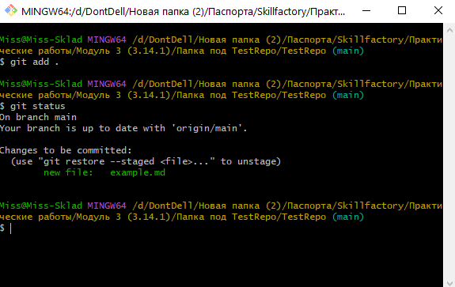

# Основы работы с Git 

##### На прошлом этапе мы создали и клонировали удалённый репозиторий на свой компьютер, а так же дали системе сведения о том, что этот компьютер именно наш.

##### Теперь-же давайте посмотрим на основной порядок работы в командной строке ***Git Bash***

На этом этапе у нас есть созданный удалённый репозиторий, без файлов в нем(кроме тех, что он создал нам автоматически), и его копия на нашем компьютере. Если мы хотим добавить в удалённый репозиторий какие-либо файлы, нам необходимо для начала добавить их в **папку с репозиторием на нашем компьютере** (Это та папка, что находится перед папкой .git).

#### Для этого мы можем просто перенести туда готовый файл, для примера я создам файл *example.md*. 

Теперь я отредактирую этот файл и добавлю в него текст ***"Hello, Student"***

И теперь после того, как мы имеем файл, готовый к отправке на удалённый репозиторий, начинаем делать следующее

1. Открываем ***Git Bash*** и добавляем наш файл в индексирование, для этого мы с вами используем команду ``git add .`` , в которой точка означает, что мы хотим добавить туда все возможные файлы.

2. Проверим её выполнение командой ``git status``

Как мы видим, система распознала файл и теперь он готов проиндексирован.

3. Затем, нам необходимо выполнить commit (коммит), это сделает ~~некое сохранение~~ снимок текущей версии кода. Выполняем команду ``git commit -m "Имя/Причина коммита"``, где -m означает что мы зададим имя коммиту сразу в ковычках. (Если необходимо дать развернутое объяснение коммиту, для этого вводим команду ``git commit`` и в выпадающем окне, в первой строке пишем заголовок, и через строку описание коммита)

Видим, что в результате коммита, ***Git Bash*** увидел 1 изменение и 1 добавление файла.
~~~
$ git commit
[main b948d97] First commit
 1 file changed, 1 insertion(+)
 create mode 100644 example.md
 ~~~

 4. Загружаем наши изменения на удалённый репозиторий командой ``git push``.
 
 GitBash пишет следующее...

 ~~~
 $ git push
Enumerating objects: 4, done.
Counting objects: 100% (4/4), done.
Delta compression using up to 4 threads
Compressing objects: 100% (2/2), done.
Writing objects: 100% (3/3), 301 bytes | 301.00 KiB/s, done.
Total 3 (delta 1), reused 0 (delta 0), pack-reused 0
remote: Resolving deltas: 100% (1/1), completed with 1 local object.
To https://github.com/doomscourge416/TestRepo.git
   09e3f33..b948d97  main -> main
 ~~~
...это означает, что мы ~~теперь крутые программисты~~ сделали всё правильно и можно проверять результат на [сайте](https://github.com/), и что мы видим.

А видим мы, что теперь у нас не один коммит, а два. Так же видим что добавился новый файл example.md.

[Читать далее...](./gitessentials32.md)

