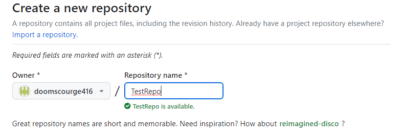

## Создать репозиторий можно  двумя способами: 
Создав директорию .git через GitBash на своем устройстве и затем загрузить его на GitHub, или Создать репозиторий на GitHub, и потом клонировать его на своё устройство

Мы с вами рассмотрим второй способ, который включает в себя работу с графическим интерфейсом сайта, что будет легче для освоения новичку.

Нам необходимо зайти [сайт **GitHub**](https://github.com/), (предварительно на нём зарегистрировавшись) :

1. Нажмите кнопку ***New***, чтобы создать репозиторий на сайте

2. Придумайте ему уникальное имя, отличное от ваших других репозиториев

3. Желательно в описании указать цели создания репозитория, но в учебных целях этот этап можно упустить

4. Выбрать будет ли ваш репозиторий доступным или скрытым от других пользователей, выбрав нужный вариант. ***Private*** - скрытый, ***Public*** - общедоступный.

5. Добавляем ***ReadMe*** файл, в котором в дальнейшем мы добавим полное описание работы нашего кода(проекта).

6. Добавляем файл ***.gitignore***. Так как мы с Вами работаем в VSCode, выбираем этот макет в выпадающем списке. 

7. Выбираем лицензию. Советую выбрать вам для начала лицензию Apache 2.0, но в дальнейшем изучите каждую, и выберите подходящую вам наиболее. 

8. Завершаем создание, нажимая кнопку ***Create Repository***

[Читать далее](./userinfo.md)

