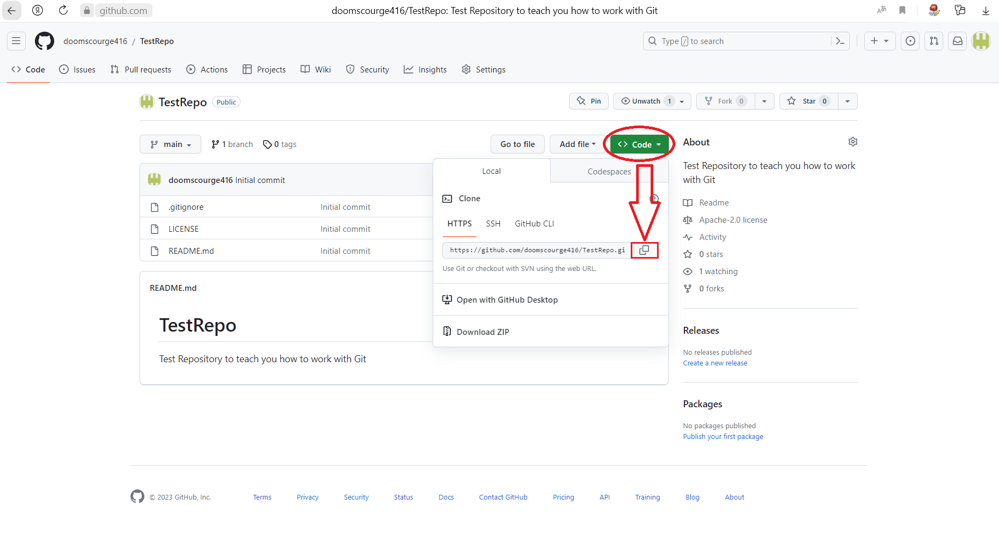
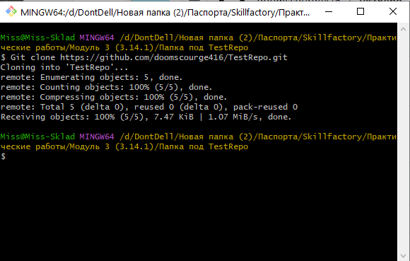

### Вам необходимо задать своему компьютеру **Имя пользователя** и **Email**.

Для Этого, откройте GitBash, и введите туда следующие команды 
~~~
git config --global user.name "Ваше Имя Пользователя"
git config --global user.email "Ваш Адрес Эл. Почты"
~~~
 
После этого, ваш компьютер будет отображаться в ***Системе Контроля Версий***, под указанными данными, и любой кто пользуется ей, может понять, какие изменения вносили именно **Вы**.

А так же Вам необходимо создать для своего компьютера уникальный ключ для определения системой, что она может получать от Вас изменения в удалённый репозиторий. Для этого, ознакомьтесь пожалуйста с данной [статьей](https://docs.github.com/ru/authentication/connecting-to-github-with-ssh/generating-a-new-ssh-key-and-adding-it-to-the-ssh-agent).

#### Теперь нам необходимо ***Клонировать*** удалённый репозиторий, созданный нами ранее.

Создаем с вами отдельную директорию(Папку), под репозиторий.

В уже открытый ***Git Bash***, вводим `` git clone ``, предварительно скопировав ~~(SSH)~~ HTTPS-Адрес со страницы репозитория ***Git***

Как мы видим, всё прошло успешно

### Теперь давайте рассмотрим основной принцип работы с ***Git*** через командную строку ***Git Bash***

Читайте [Главу 3.Основы работы с Git](./gitessentials3.md)