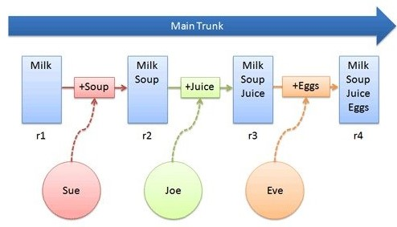
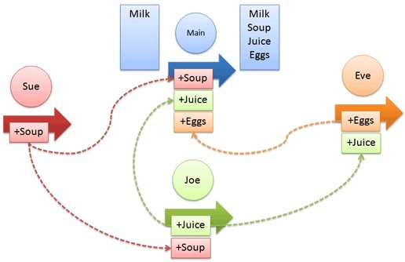

# Система контроля версий Git

***Система котроля версий*** - это программное обеспечение для просмотра и контроля всех изменений кода. В данной инструкции, я расскажу вам конкретно о системе контроля версий **Git** и особенностях работы с ней.

**Системы контроля версий бывают:**

1. Централизованные 
2. Распределённые 

#### В централизованных системах используется единственный сервер, где откуда все пользователи моугт обратится к актуальному, рабочему коду.
  

  Как вы видите, пользователи вносят свои изменения в части кода централизованного репозитория.

#### А в распределённых системах, в своё время, пользователь скачивает себе на локальное устройство весь *репозиторий* и в случае критических ошибок и утери кода из-за ошибок на сервере и человеческого фактора - работающая полная версия кода останется на каком-либо локальном устройстве пользователя

В распределённых репозиториях, у каждого пользователя есть своя копия репозитория на локальном устройстве, в которые он вносит изменения и затем загружает их на сервер.

#### Поэтому предпочтительным для нас будет выбор распределённого *репозитория*, в частности **GIT**.

А что же такое репозиторий?

### ***Репозиторий*** - это хранилище каких либо данных, в нашем случае система контроля версий, содержащая наш актуальный код проекта.

И как создать свой репозиторий и начать работу с ним, я расскажу вам во [Главе 2. Начало Работы с Git](./gitstartup2.md) 